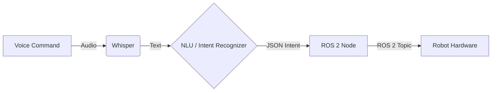

This chapter explores the fundamental concepts behind converting a spoken command into a robotic action. This voice-to-action pipeline is a cornerstone of modern human-robot interaction (HRI).

## The Whisper-to-ROS 2 Pipeline

The process can be broken down into four main stages:

1.  **Audio Capture**: A microphone captures the user's voice command as raw audio data.
2.  **Transcription**: The audio data is fed into a speech-to-text engine, such as **OpenAI's Whisper**, which transcribes the audio into text.
3.  **Intent Recognition**: The text is processed by an LLM or NLU model to interpret the goal and convert it into a structured format (e.g., JSON).
4.  **Action Execution**: The structured intent is converted into a ROS 2 command (e.g., a `Twist` message or a `Nav2` goal).

---

### Data Flow Diagram



---

### Example: Navigation Intent

-   **Voice Command**: "Robot, move forward."
-   **Whisper Output**: `"Robot, move forward."`
-   **Intent Recognizer Output**: 
```json
{ 
  "action": "move", 
  "direction": "forward", 
  "speed": 0.5 
}
```
-   **ROS 2 Action**: A `geometry_msgs/Twist` message is published to `/cmd_vel` with `linear.x = 0.5`.