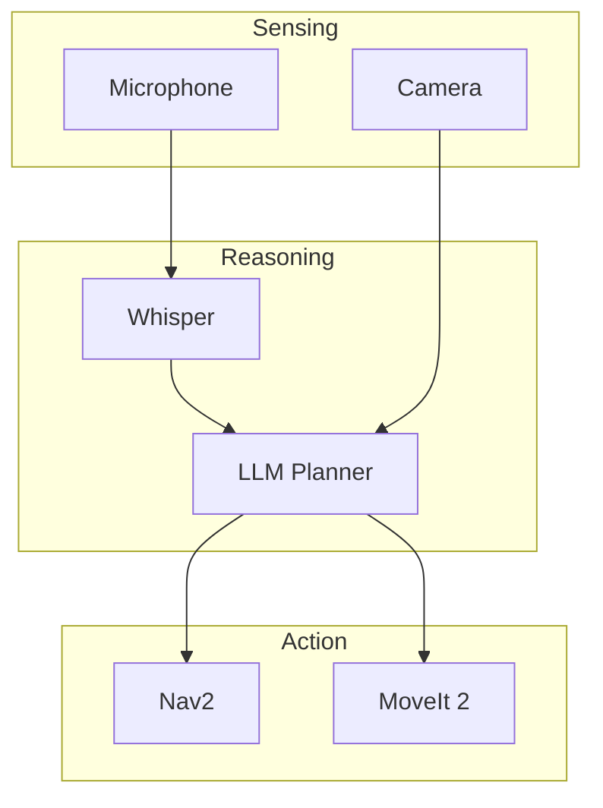

This chapter illustrates the full end-to-end system, where perception, reasoning, and action come together.

## The Full VLA Workflow

The Vision-Language-Action (VLA) model integrates **perception** (vision), **reasoning** (language), and **execution** (action) into a cohesive system.

### Integration Steps
1.  **Transcription**: Whisper converts voice to text.
2.  **Reasoning**: An LLM analyzes the command and the visual scene (from Isaac ROS).
3.  **Planning**: The LLM outputs a series of Nav2 goals and manipulation commands.
4.  **Execution**: The robot moves and interacts using its control stack.

---

### System Architecture Diagram

---

## Future Directions: Multi-Agent Collaboration
The next frontier in VLA is multi-robot collaboration. Imagine telling a team of robots to "Clean the house," and they autonomously divide tasks: one robot vacuums (Nav2) while another picks up toys (MoveIt).

## Conclusion
You have now explored the complete stack for the next generation of Physical AI. From ROS 2 foundations to high-level cognitive planning, you are ready to build robots that can see, hear, and act in the real world.